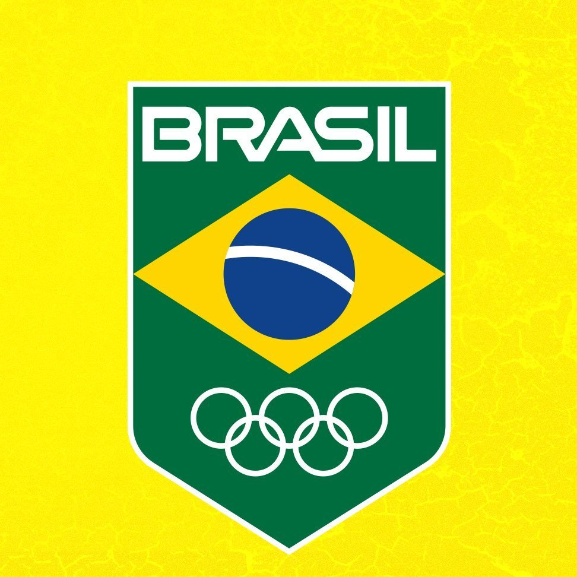
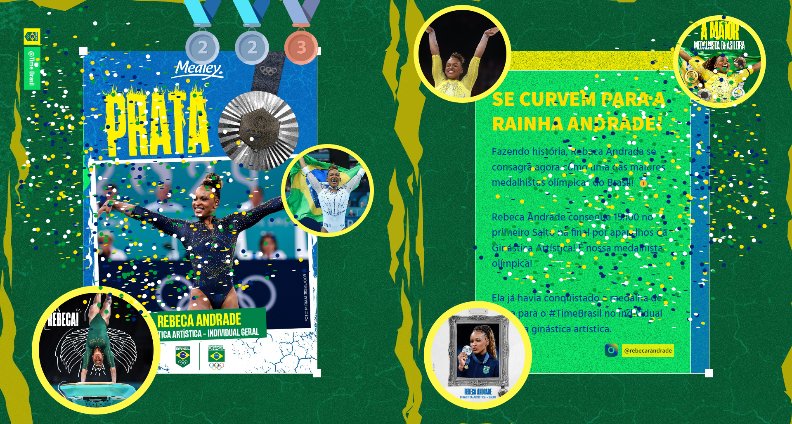

# 🥇 Brazilian Athletes Medal Tracker for Paris 2024 🥇

Welcome to the Brazilian Athletes Medal Tracker for the Paris 2024 Olympics! This application is designed to keep you updated with real-time information on the medal standings of Brazilian athletes, featuring a modern design and seamless user experience.

## Overview

This project aims to provide a platform for tracking the performance of Brazilian athletes at the Paris 2024 Olympics. With real-time updates and a sleek design, you can stay informed on every medal win and celebrate the successes of our athletes.

## Key Features

- 📈 **Real-time Updates**: Stay up-to-date with the latest medal standings as they happen.
- 🎨 **Modern Design**: Enjoy a visually appealing and user-friendly interface.
- 📸 **Official Images**: All images are sourced from the official Instagram profile of Team Brazil ***(@timebrasil)***, showcasing athletes during their performances and on the podium.

## How It Works

The project is a single-page application (SPA) that dynamically updates the displayed medalists based on your scroll actions. As you scroll up or down, the medalists and their achievements are updated in real time, providing an engaging and interactive experience.

## Technologies Used

| Technology           | Description                                     |
| -------------------- | ----------------------------------------------- |
| 🛠️ Vite              | Fast and modern frontend build tool             |
| ⚛️ React             | JavaScript library for building user interfaces |
| 💅 styled-components | CSS-in-JS for styling React components          |

## About Rebeca Andrade

Rebeca Andrade has recently emerged as one of Brazil's greatest medalists. Her outstanding performances have made her a household name, and she continues to inspire many with her dedication and skill. Her achievements in gymnastics have brought pride to Brazil, and she is celebrated for her resilience and excellence.

Andrade has currently 5 medals in her collection, including 1 gold, 3 silver, and 1 bronze. Her remarkable journey is a testament to the power of hard work and determination, and she is a role model for aspiring athletes around the world.

### Deployment
The project is deployed and accessible at: **[Time Brasil](https://brazilian-athletes-medal-tracker.netlify.app/)**

**Let's gooo 🇧🇷🥇🥈🥉**
